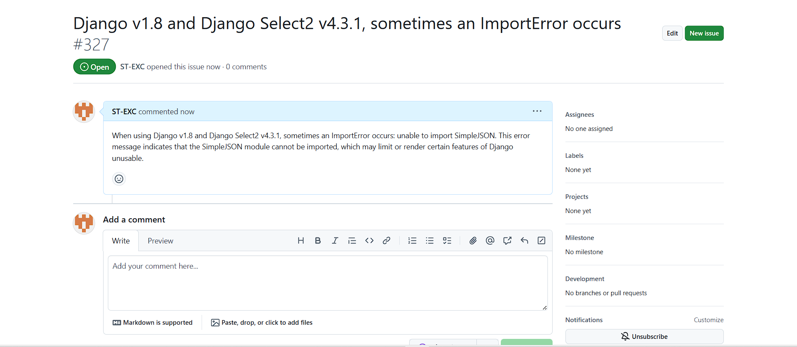

# Django ImportError: 无法导入simplejson

**在本文中，我们将介绍Django在使用[django-Select2 v4.3.1时出现的ImportError: 无法导入simplejson问题，并提供解决方案和示例说明。**

## 问题描述

**在使用Django v1.8和django-Select2 v4.3.1时，有时会出现ImportError: 无法导入simplejson的错误。该错误信息表明无法导入simplejson模块，这可能会导致Django的某些功能受限或无法使用。**



## 解决方案

**要解决这个问题，我们可以采取以下步骤：**

### 步骤1：更新Django版本

**首先，我们应该尝试更新Django的版本。simplejson是Django的一个依赖项，而在Django v1.8中，simplejson已被内置的json模块替代。因此，通过升级Django至最新版本，可能会解决该导入错误。**

**我们可以使用以下命令来升级Django：**

```
 pip install --upgrade django
```

### 步骤2：检查django-Select2版本

**如果步骤1未解决问题，我们还可以尝试更新django-Select2的版本。在一些旧版本的django-Select2中，可能还在使用simplejson模块，而不是内置的json模块。通过更新django-Select2至最新版本，可能也能解决导入错误。**

**我们可以使用以下命令来升级django-Select2：**

```
 pip install --upgrade django-Select2
```

### 步骤3：手动导入json模块

**如果以上两个步骤均未解决问题，我们可以尝试手动导入json模块来解决导入错误。在Django v1.8中，默认已经内置了json模块，因此我们可以直接使用它来代替simplejson。**

**我们可以在出现错误的代码文件中加入以下导入语句：**

```
 from django.utils import simplejson as json
```

**这样，我们就可以使用json模块来替代simplejson。**

## 示例说明

**让我们通过一个例子来说明解决方案。**

**假设我们有一个Django项目，其中使用了django-Select2 v4.3.1。在运行项目时，我们遇到了ImportError: 无法导入simplejson的错误。**

**为了解决这个问题，我们首先尝试升级Django和django-Select2的版本。在终端中运行以下命令：**

```
 pip install --upgrade django
 pip install --upgrade django-Select2
```

**如果升级仍未解决问题，我们可以尝试手动导入json模块。在出现错误的代码文件中，我们加入以下导入语句：**

```
 from django.utils import simplejson as json
```

**这样，我们就可以使用json模块来替代simplejson。**
