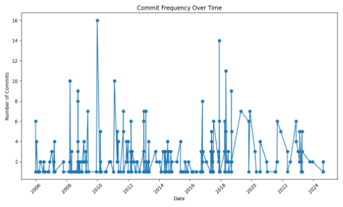
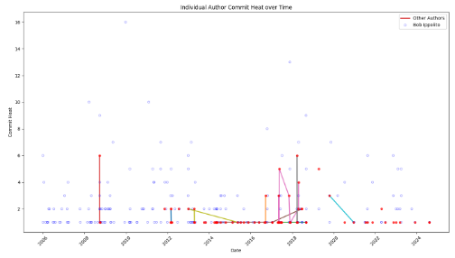
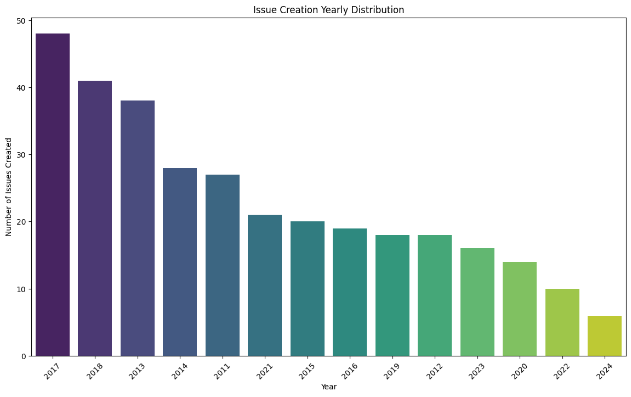
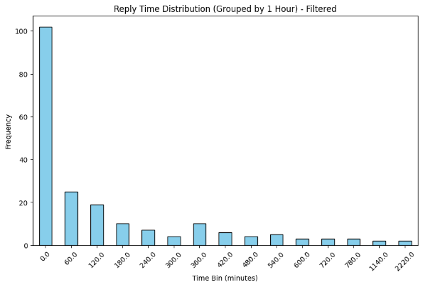
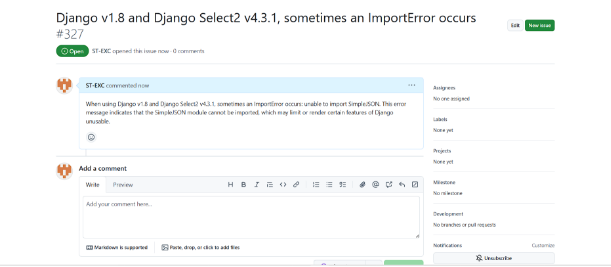



**开源软件基础大作业**

**对开源项目Simplejson的分析**

学       院：      软件学院         

专       业：      软件工程         

小 组 成 员：      韩林哲           

小 组 成 员：      何恩驰           

小 组 成 员：      王瑞             

小 组 成 员：      谭炜明           

小 组 成 员：      张远浩           

大连理工大学

Dalian University of Technology

大连理工大学本科毕业论文（设计）题目
# 摘    要

`	`Simplejson 是一个用于 Python 的高效 JSON 编解码库，其目标是提供简单、快速且可扩展的功能，同时确保对不同版本的 Python 提供良好的兼容性。为了分析 simplejson 的开源生态和发展历程，我们开展了一项综合研究，涵盖了提交记录、版本发布、问题报告，以及代码质量评估。

`	`在研究中，我们首先通过获取项目的提交记录，分析了其开发活动的历史趋势。这些记录显示，simplejson 自创建以来始终保持稳定的维护，体现出开发团队对项目的持续关注。接着，我们审查了项目的版本发布历史，发现最新版本 3.19.3 于 2024 年 8 月发布，表明该项目仍处于活跃的开发状态。与此同时，我们系统地检查了问题报告的处理情况。当前有 18 个开放问题和 182 个已解决问题，这反映了社区的活跃度和开发者的响应能力。此外，我们还使用模糊测试技术对 simplejson 的代码质量进行了评估。结果表明，库的实现经过精心设计和测试，没有发现重大缺陷。

`	`综合以上分析可以得出结论，simplejson 是一个高度可靠且备受信任的开源项目。其稳定的维护、频繁的版本更新以及高质量的代码实现，使其成为了一个便捷而且可靠的工具。这一研究不仅帮助我们深入了解了 simplejson 的生态系统，也为其他开源项目的研究和改进提供了参考。

**关键词：开源软件；项目分析；模糊测试**

\- I -
大连理工大学本科毕业论文（设计）题目

注：在该页面中点击鼠标右键，选择“更新域…”，在弹出窗口中选择“更新整个目录”，确定即可自动生成目录。标题“目录”，字体：黑体，字号：小三。章、节标题和页码，字体：宋体，字号：小四。阅后删除此文本框。
目    录

[摘    要	I]()

[引    言	1]()

[1  项目Commit记录分析	1]()

[1.1	提交频率分析	2]()

[1.2  贡献者分析	3]()

[1.3  提交类型分析	4]()

[2  项目Bug Report/Issue情况分析	6]()

[2.1  图的格式说明	6]()

[2.1.1  图的格式示例	6]()

[2.1.2  图的格式描述	6]()

[2.2  表的格式说明	7]()

[2.2.1  表的格式示例	7]()

[2.2.2  表的格式描述	8]()

[2.3  公式的格式说明	9]()

[2.3.1  公式的格式示例	9]()

[2.3.2  公式的格式描述	9]()

[2.4  参考文献的格式说明	9]()

[2.4.1  参考文献在正文中引用的示例	9]()

[2.4.2  参考文献在正文中引用的书写格式	9]()

[2.4.3  参考文献的书写格式	9]()

[2.4.4  参考文献的书写格式示例	9]()

[2.5  量和单位的使用	10]()

[2.5.1  使用方法	10]()

[2.5.2  中华人民共和国法定计量单位	10]()

[2.6  规范表达注意事项	11]()

[2.6.1  名词术语	11]()

[2.6.2  数字	11]()

[2.6.3  外文字母	11]()

[2.6.4  量和单位	12]()

[2.6.5  标点符号	12]()

[3 模糊测试实验设计	13]()

[3.1  封面	13]()

[3.2  原创性声明	13]()

[3.3  关于使用授权的声明	13]()

[3.4  中英文摘要	13]()

[3.5  目录	13]()

[3.6  正文	13]()

[5  第五章题目（黑体，小三，1.5倍行距，段后1行）	14]()

[5.1  第一节题目（黑体，四号，1.5倍行距，段前0.5行）	14]()

[5.1.1  第一节一级题目（黑体，小四，1.5倍行距，段前0.5行）	14]()

[5.2  第二节题目	14]()

[5.2.1  第二节一级题目	14]()

[结    论（设计类为设计总结）	15]()

[、附录A  附录内容名称	16]()

\- III -
大连理工大学本科毕业论文（设计）题目
# 引    言
Simplejson 是一个开源 Python 库，用于实现高效的 JSON 编解码而JSON 是现代软件开发中数据交换的重要格式，其性能和可靠性对数据传输和处理具有重要影响。为深入分析 simplejson 的生态现状与开发趋势，我们设计了一套综合性分析方案，通过对其开发活动、社区反馈和代码质量的多维度研究，全面评估其开源生态系统和功能实现。

本方案的设计基于对开源项目的典型生命周期和维护模式的理解。我们从以下几个方面展开研究：一是通过分析提交记录和版本发布历史，了解项目的开发活跃度和功能演进路径；二是通过审查问题报告和处理状态，评估社区的参与度及问题解决效率；三是结合代码模糊测试，验证项目在异常输入情况下的稳定性和鲁棒性。这些研究方法相辅相成，以尽可能的分析 simplejson 的质量、可靠性及社区活跃度。

研究中我们特别关注几个设计重点：

**项目开发的持续性与活跃度**：通过对提交记录的时间轴分析，识别其是否处于长期维护状态，并展示关键功能点的开发历程。

**社区反馈与响应效率**：通过分析问题报告的数量、类型及解决情况，探讨用户反馈对项目改进的影响，以及维护团队的响应能力。

**代码的健壮性与性能**：采用模糊测试技术，对代码在边界条件和异常输入下的行为进行验证，确保其符合高性能和高可靠性的设计目标。

在研究和设计过程中，我们注重针对这些重点问题提出明确的解决思路。例如，在分析提交记录时，我们结合时间节点与版本更新特性，分析项目的开发活动历程；在模糊测试中，我们通过构造多样化的输入集，评估代码的边界处理能力。通过对这些核心环节的关注与研究，旨在形成对 simplejson 的全面理解，同时为开源软件分析提供一种可参考的研究方法。

注：页码，居中，底部，宋体，小五，正文起始页页码为1。

阅后删除此文本框。

# 1  项目Commit记录分析
`	`在本次报告中，我们对 simplejson 的开源生态进行了深入分析，从贡献者、提交类型到提交频率的维度全方位探讨其发展历程和现状。我们首先利用从git仓库取得的数据生成提交历史记录，提交类型提交作者等数据文件，随后编写python代码，利用pandas，matplotlib库对其进行数据分析以及数据可视化，从多方面展示项目的历史发展情况。

分析显示，simplejson 在项目早期由核心开发者 Bob Ippolito 主导，凭借高频次的提交奠定了项目功能的基础。然而，随着功能逐渐完善和社区贡献的局限性，项目进入了维护为主的阶段，近年的提交频率显著下降，呈现出低活跃状态。而且，从提交类型来看，simplejson 的开发过程在功能开发、漏洞修复、文档完善和性能优化之间保持了良好的平衡性，尤其在稳定性和易用性上表现出色。然而，其开发生态显示出典型的单核驱动特征，社区贡献者的参与度和贡献强度较低。
1. ## 提交频率分析
   

   图1.1  提交频率图

`	`从图1.1提交频率图中可以看到，simplejson 项目的开发活跃度呈现出显著的波动特性。项目在 2006 年创建初期，每月的提交次数较低，但在 2008 至 2012 年间经历了一段开发的活跃高峰，尤其是在 2010 年前后，单月提交数甚至超过 16 次。这一时期提交频率呈现持续高峰。结合提交类型的分析推测，这一时期是项目功能开发的关键时期，核心功能如高效 JSON 编码与解码的实现可能主要在此阶段完成。同时，随着用户的增加和功能需求的扩大，这一阶段的提交中可能包含了大量的功能完善和性能优化工作。

`	`自 2012 年后，项目的提交频率逐渐下降，直到 2017 年再次迎来一个短暂的活跃期，这一时期可能是项目维护者集中处理用户反馈、进行代码重构或进行重要版本发布的阶段。提交频率的短期提升表明项目仍受到用户的关注，并且维护者对用户需求做出了积极响应。随后从 2018 年至今，提交频率逐步降低，甚至出现了较长时间的开发停滞。这表明项目功能已较为稳定，维护者的主要精力可能转向修复问题和优化性能，而非大规模的功能开发。2020 年以后的提交次数稀疏，显示出项目可能进入了低维护状态或接近停止更新。

`	`提交频率的波动性为我们揭示了项目生命周期的典型特征：从早期的快速迭代到功能稳定后的低频维护，simplejson 的发展路径反映了一个开源项目从创立到成熟的过程。这种活跃度的变化并非异常，而是开源软件中较为普遍的现象。

## 1.2  贡献者分析

图1.2  贡献者提交图

在图1.2中，所有由作者“Bob Ippolito”提交的记录都由浅蓝色空心圆标注，而所有其他作者都由红色实心圆标注，而且同一个非“Bob Ippolito”的作者的提交记录被不同颜色的实心折线连接。

从提交统计数据中可以看出，Bob Ippolito 是 simplejson 项目的主要维护者，在我们读取到的数据中他一人贡献了 491 次提交，占总提交数的绝大部分。这表明 simplejson 是一个以核心开发者为主导的项目，而非分布式的社区驱动型开发。Bob Ippolito 的主导地位使得项目在早期能够快速迭代，聚焦核心功能的实现和完善。然而，这种强依赖个人的开发模式也可能带来风险，当主要维护者减少对项目的投入时，可能导致开发活跃度下降或项目停滞。

除 Bob Ippolito 外，其余贡献者的提交数量相对较少。其中，Serhiy Storchaka 提交了 23 次，其余如 Richard van der Hoff 和 Matthew Dempsky 的贡献仅为 8 次，还有更多的贡献者提交次数不足 5 次，甚至相当一部分的贡献者只有1次提交记录。由此可以看出，虽然该项目吸引了一定数量的社区参与者，但这些贡献者的参与频率和贡献力度相对较低。这种模式在一定程度上限制了社区的多样化发展，项目的决策和技术路径很大程度上依赖于核心维护者的方向。此外，较低的社区参与度可能对未来项目的可持续性造成一定影响。

从以上数据可以得到，simplejson 的开发是个人开发驱动的，这种模式对于项目的初创期至关重要，因为单一核心开发者能够快速推动项目进展。然而，随着项目的稳定和功能的完善，引入更多的社区参与者可以提高代码质量、分担维护压力，并使项目更具韧性。因此，这种“单核驱动”的特性是项目未来需要重点改进的方向。
## 1.3  提交类型分析
表1.1  提交类型

|类型|Count|
| :-: | :-: |
|Other|336|
|Bug Fix|103|
|Feature|49|
|Documentation|40|
|Version Release|38|
|Test|20|
|Performance/Refactor|4|
|Configuration/Environment|14|

我们对从git仓库中获取到的更新描述信息进行关键词提取处理，以不同关键词代表提交的内容，随后统计总数，主要关注的方面如表格1.1中所示。

通过分析提交类型的分布，发现 "Other" 类型的提交最多，共计 336 次。这个类别可能涵盖了代码优化、性能调整、架构重构等非功能性的更新。这表明项目的开发过程较为全面，维护者在功能完善的基础上也关注了代码的长期可维护性和性能改进。

而"Bug Fix"（漏洞修复）是第二大提交类别，总计 103 次，显示出 simplejson 的开发者高度重视项目的稳定性和用户反馈的处理。通过大量的修复提交，项目能够快速应对已知问题，提高软件的可靠性。这种模式有助于增强用户对项目的信任，并确保其在不同场景中的适配能力。

新功能（Feature）开发的提交数量为 49 次，在总体提交中占比较低。这个比例表明 simplejson 的核心功能已经较为完善，后续开发工作以维护和优化为主。这种开发节奏符合成熟项目的特性，即更多地关注稳定性和易用性，而非大规模的功能新增。

文档更新（Documentation）和版本发布（Version Release）分别有 40 次和 38 次提交。文档更新的数量表明项目在开发过程中注重使用文档的完善，这有助于降低用户的学习成本，吸引更多开发者使用和贡献代码。而版本发布的频率体现了项目在版本管理上的规范性，为用户提供了稳定的更新节奏和明确的功能变化说明。

从提交类型的总体分布来看，simplejson 在不同开发维度上都保持了较好的平衡性，尤其是在代码质量和功能稳定性上的关注度较高。然而，"Feature" 类型的提交占比较低也反映了项目的一个特点，即功能上的相对稳定性和长期维护性。这种特性对于一个专注于 JSON 编解码的项目而言，是符合预期的。

# 2  项目Bug Report/Issue情况分析
`	`在现代的软件开发中，Bug的管理和追踪至关重要，特别是对一个长期运维和开发的项目。有效的Bug跟踪可以帮助开发团队及时识别问题、优化代码质量、提高系统的稳定性，并最终提升用户体验。在我们的工作中，我们通过不同的工具和方法进行追踪和分析Bug的类型以及其处理过程，此外我们使用了包括Python的matplotlib、seaborn、pandas等库以及GitHub API，来收集、分析和可视化Bug数据，以便与更好的分析该开源项目的生态情况。通过图表数据的分析，我们可以得出项目在处理Bug时的一些关键指标，并对未来的改进方向提供建议，此外我们还手动找出了本项目的一个Bug，并且提交了Issue。以下是我们针对Bug情况的详细分析。
## 2.1  Issue分布情况
`	`通过对simplejson项目中Bug的年度创建分布进行分析，我们能够直观地观察到Bug报告数量随时间的变化趋势。为了收集这些数据，我们使用了Python库中的github API，结合csv库，将数据导出并进一步分析，获得的数据形式如图2.1。

`	`

图2.1  数据情况

`	`通过该方式，我们成功提取了包括Issue ID、创建时间、首次评论时间及回复时间等信息。这些数据可以帮助我们分析每年Bug的分布情况，进一步通过matplotlib，pandas

，seaborn库对csv表格进行处理，我们得到了Issue创建年度分布图，如下：

图2.2  Issue在不同时间的分布

`	`从图2.2中可以看到，2017年是Bug报告的高峰期，接近50个Bug报告被提交。2017年是项目初期阶段，很多问题在这个阶段暴露出来。随着项目的逐步开发和稳定，Bug报告的数量逐年减少，尤其是在2022年和2024年，Bug报告的数量显著下降，显示出项目逐渐成熟和稳定。这表明项目在开发后期趋于稳定，Bug的数量在减少，开发团队的响应效率和Bug预防措施得到了改进。

## 2\.2  Issue处理情况
`	`Bug的处理情况直接影响到项目的进度和质量，尤其是在复杂系统中。我们进一步分析了Issue的回复时间，以衡量开发团队的响应速度。我们使用matplotlib和seaborn库绘制了Issue回复状态和回复时间分布图，从而更清晰地了解Bug的回复情况。

`	`

图2.3  Issue回复状态图

`	`从图2.3中可以看到，绝大多数Bug（76.2%）得到了及时回复。这可以表明开发团队能够处理大多数提交的Issue，进一步表明了开发者团队对社区反馈的重视。值得注意的是，仍然有23.8%的Bug未能及时得到回复，这可能是由于这些Bug的复杂性较高，或者因为开发团队的资源不足，导致部分Bug未能得到及时处理。我们认为，为了提升响应效率，开发团队应加强Bug的优先级分类，特别是对高优先级Bug的及时跟进，确保所有问题能够得到有效处理。

`	`

图2.4  Issue回复时间分布图

`	`通过图2.4我们可以看到，大部分Bug的回复时间集中在0至60分钟之内，证明开发团队能够在很短的时间内对大多数Bug进行回复。随着时间的推移，回复时间逐渐增加，超过6小时以上的回复频率显著下降。这个趋势表明，大部分Bug是快速解决的，不过也可能存在一些过于复杂的Bug或者是开发者们不太关注的问题，开发团队需要更多的时间来分析和修复或者是推迟修复。这种现象也提示我们，团队可以优化Bug的处理流程，对于复杂的Bug，可以提前识别并分配更多资源进行调度，从而提高整体的解决效率。
## 2\.3  被我们发现的Bug
`	`在我们对开源仓库的分析工作中，我们还发现了一个bug，在使用Django v1.8和django-Select2 v4.3.1时，有时会出现ImportError: 无法导入simplejson，导致Django的某些功能受限或无法使用。

`	`而解决的方法是更新Django与django-Select2版本，如果仍然不能解决问题则手动导入json模块来解决导入错误。

` 				        `from django.utils import simplejson as json

这样，我们就可以使用json模块来替代simplejson。

`	`此外，我们也将这个Bug作为Issue进行了提交，如图2.4。

图2.4  Issue提交

# 3 模糊测试实验设计
# 3.1  封面
按照首页格式制作封面。
## 3.2  原创性声明
单面打印。
## 3.3  关于使用授权的声明
单面打印。
## 3.4  中英文摘要
单面打印。
## 3.5  目录
双面打印。
## 3.6  正文
正文从引言开始到致谢结束，双面打印。

#

# 结    论（设计类为设计总结）
结论是理论分析和实验结果的逻辑发展，是整篇论文的归宿。结论是在理论分析、试验结果的基础上，经过分析、推理、判断、归纳的过程而形成的总观点。结论必须完整、准确、鲜明、并突出与前人不同的新见解。

书写格式说明：

标题“结论”选用模板中的样式所定义的“结论”，或者手动设置成字体：黑体，居中，字号：小三，1.5倍行距，段后1行，段前为0行。

结论正文选用模板中的样式所定义的“正文”，每段落首行缩进2字；或者手动设置成每段落首行缩进2字，字体：宋体，字号：小四，行距：多倍行距 1.25，间距：段前、段后均为0行。

–13–
